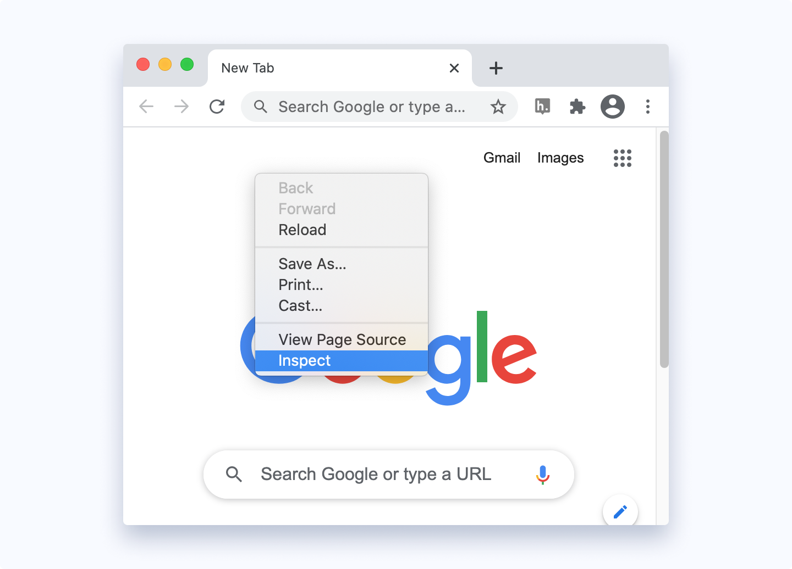
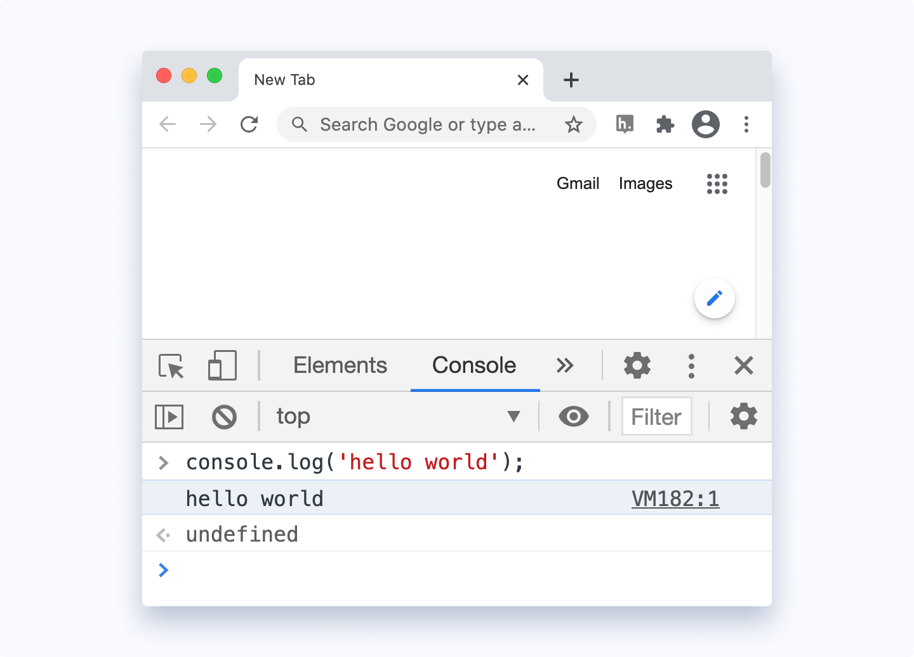

# How to start coding in Javascript
#### You can run Javascript in several ways namely
- Using console tab of web browsers
- Using Node.js
- By creating web pages
## 1. Using Console Tab of Web Browsers
All the popular web browsers have built-in JavaScript engines. Hence, you can run JavaScript on a browser. To run JavaScript on a browser,

- Open your favorite browser (here we will use Google Chrome).
- Open the developer tools by right clicking on an empty area and select Inspect. __Shortcut: F12__

- On the developer tools, go to the console tab. Then, write JavaScript code and press enter to run the code.
